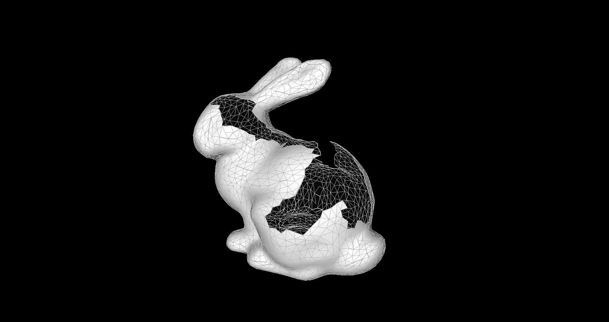
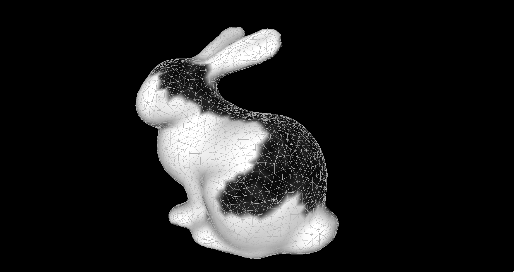
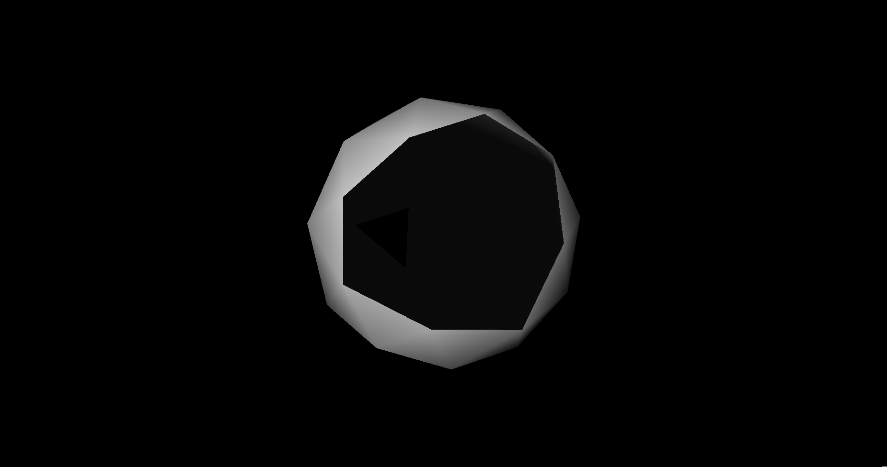
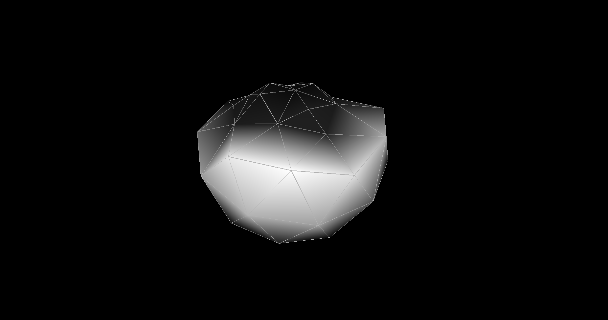
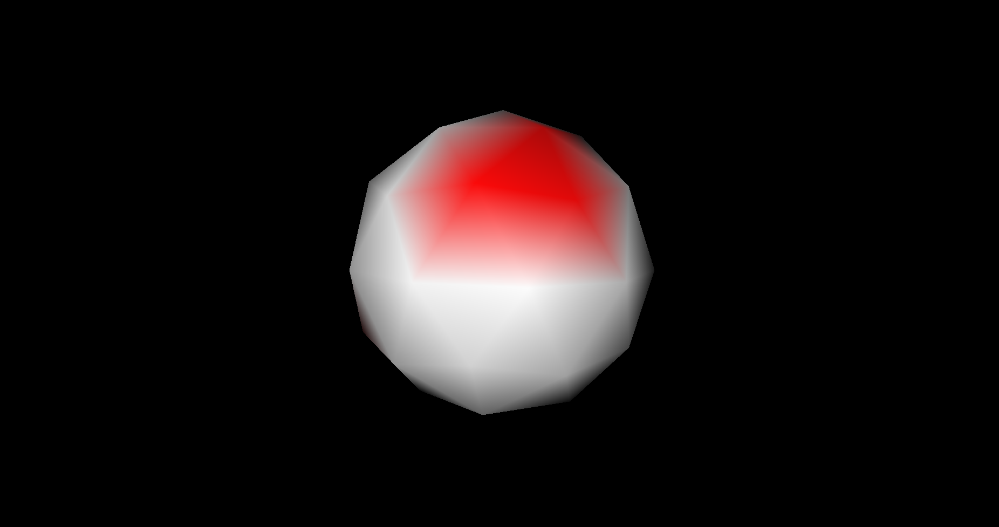
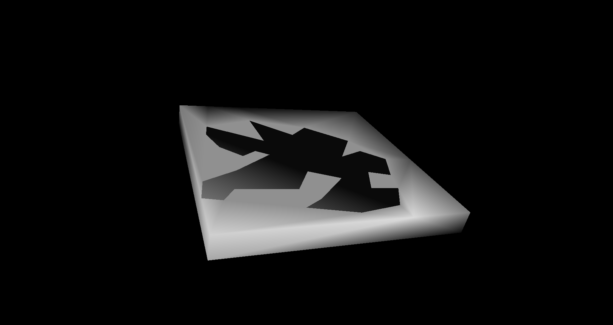
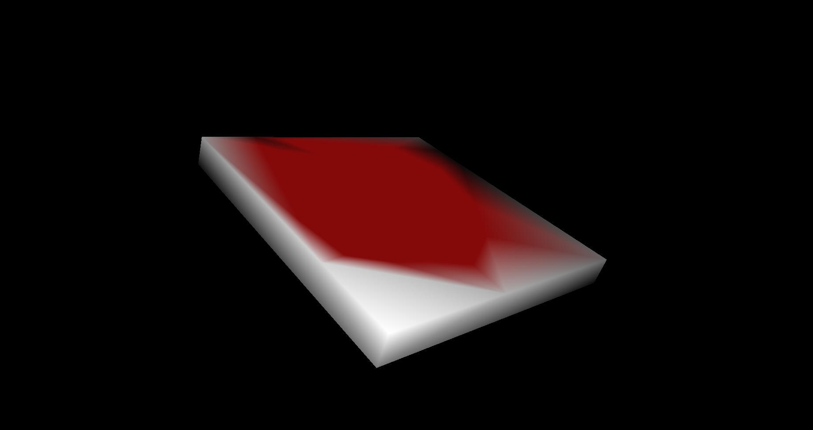
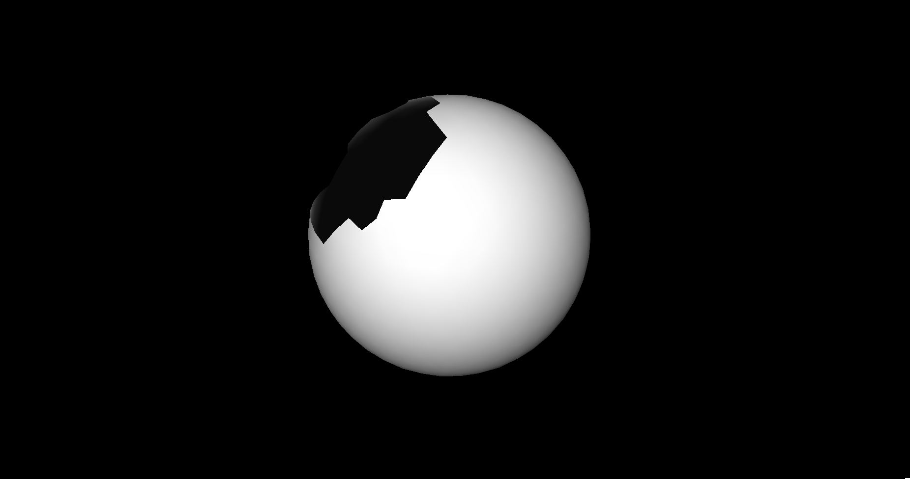
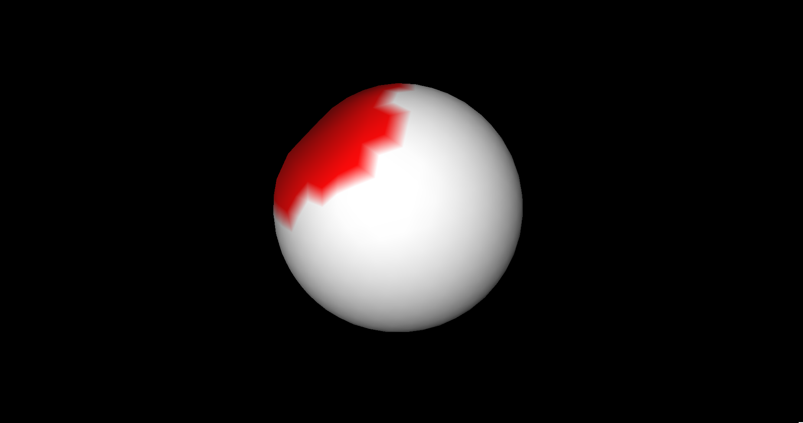

# holyFiller
Fills holes in meshes based on [P. Liepa (2003), Filling Holes in Meshes](https://diglib.eg.org/bitstream/handle/10.2312/SGP.SGP03.200-206/200-206.pdf?sequence=1&isAllowed=y).

All steps implemented:
* boundary identification,
* hole triangulation,
* refinement, and
* fairing.

Two methods are implemented for hole triangulation: min-max dihedral angle fill and minimum area fill.

Fairings:
* Uniform umbrella-operator
* Scale-dependent umbrella operator
* Harmonic umbrella operator
* Whole-mesh uniform umbrella-operator
* Whole-mesh scale-dependent umbrella operator

This repository is prepared for CENG589/789 Digital Geometry Processing course term project assignment.

