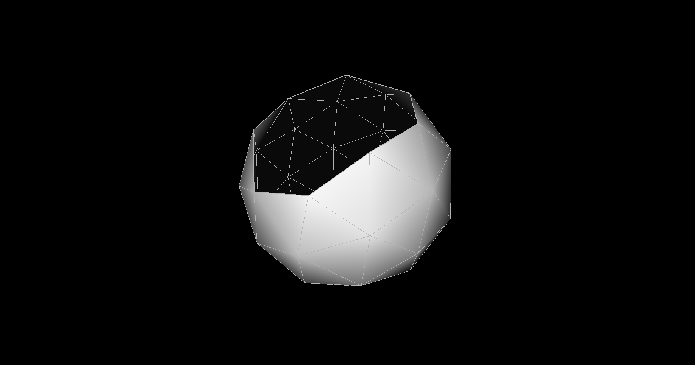
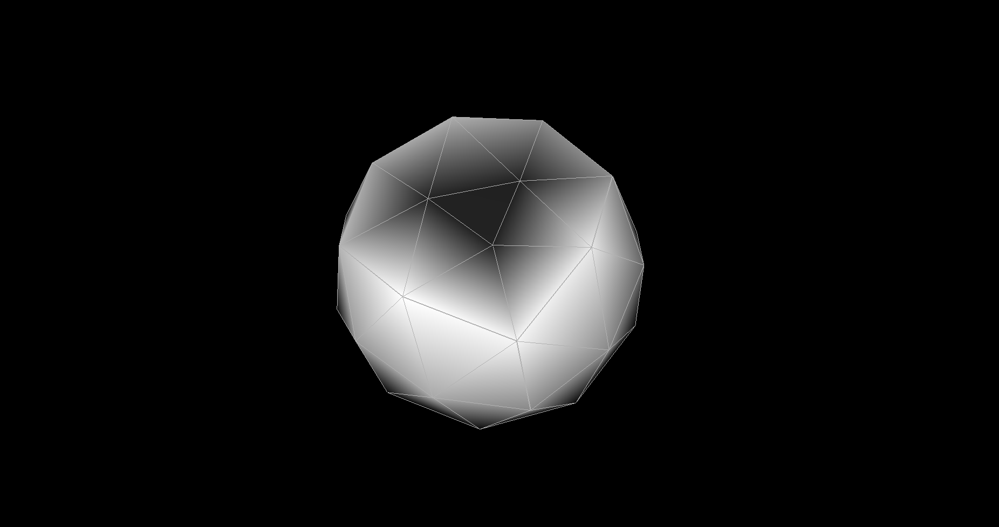
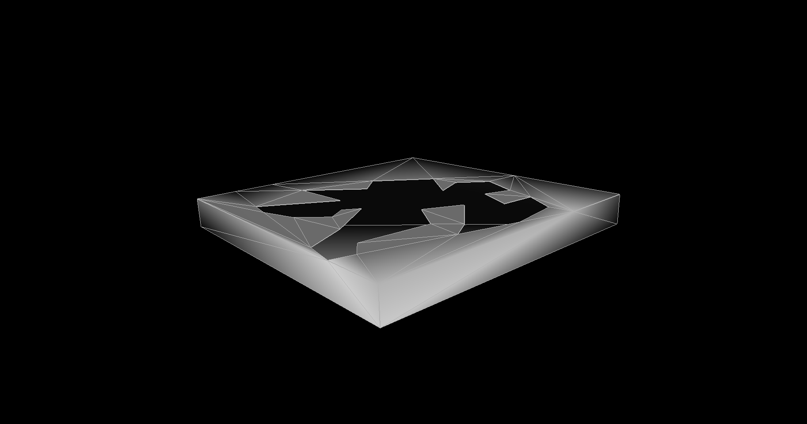
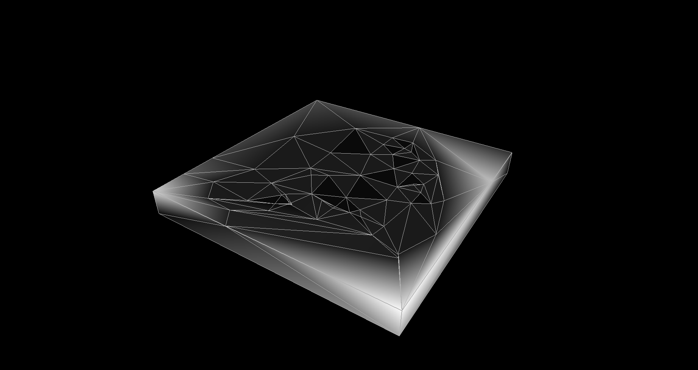
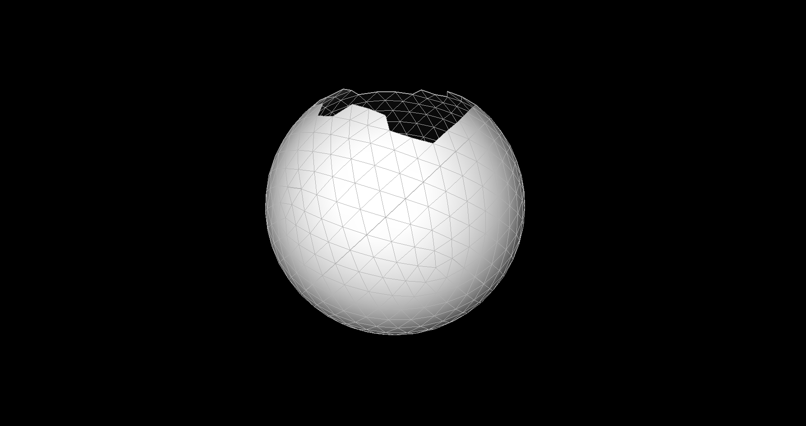
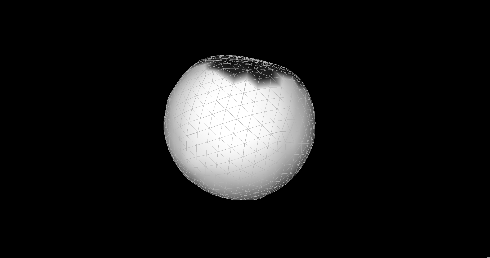

# holyFiller
Fills holes in meshes based on [P. Liepa (2003), Filling Holes in Meshes](https://diglib.eg.org/bitstream/handle/10.2312/SGP.SGP03.200-206/200-206.pdf?sequence=1&isAllowed=y).

Two methods are implemented: min-max dihedral angle fill and minimum area fill. Refinement and fairing steps are not implemented.

This repository is prepared for CENG589/789 Digital Geometry Processing course term project assignment.

